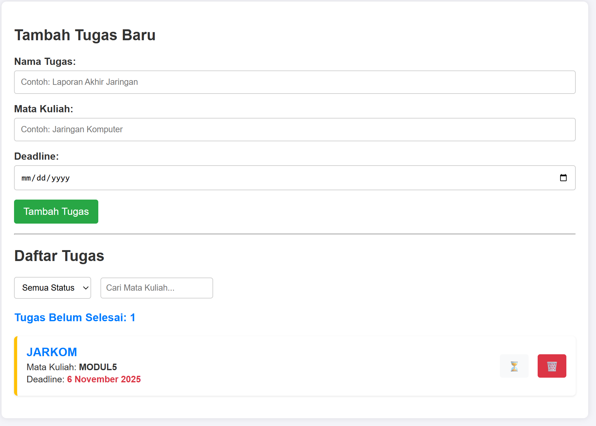
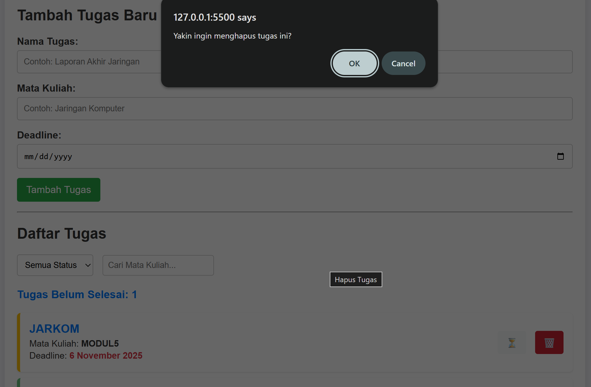
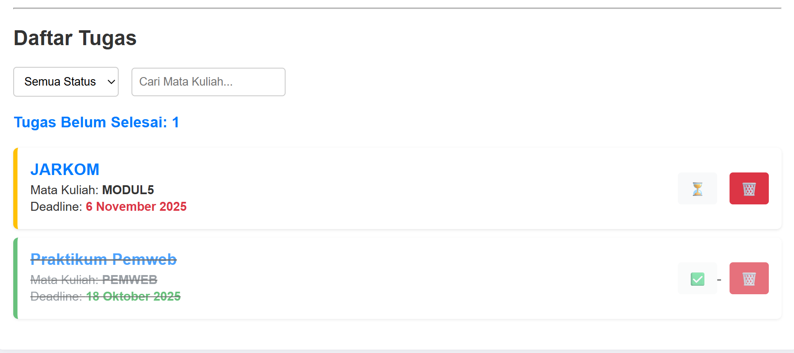

# 📚 KuliahKU - Student Task Manager

## 💡 Deskripsi Aplikasi

**KuliahKU** adalah aplikasi manajemen tugas interaktif yang dirancang khusus untuk membantu mahasiswa mengelola aktivitas akademik mereka, mulai dari tugas harian, laporan, hingga persiapan ujian. Aplikasi ini menyimpan semua data tugas secara lokal di browser Anda menggunakan localStorage, memastikan data Anda aman dan tersedia bahkan saat offline.

## 🚀 Fitur Utama
## 🚀 Fitur Utama

Aplikasi ini mengimplementasikan fungsi CRUD (*Create, Read, Update, Delete*) lengkap, serta fitur pengelolaan data yang canggih:

| Kategori | Fitur |
| :--- | :--- |
| **Data Tugas** | Menambah, mengedit, dan menghapus tugas (nama tugas, mata kuliah, deadline). |
| **Status Tugas** | Menandai tugas sebagai **Selesai** (`✅`) atau **Belum Selesai** (`⏳`). |
| **Pencarian & Filter** | Mencari tugas berdasarkan **Mata Kuliah** dan memfilter berdasarkan **Status** (Semua, Selesai, Belum Selesai). |
| **Statistik** | Menampilkan jumlah tugas yang **Belum Selesai** secara *real-time*. |
| **Penyimpanan** | Menggunakan `localStorage` untuk menyimpan data secara persisten dan lokal di *browser*. |
| **Validasi** | Menerapkan validasi untuk memastikan input pengguna (nama, mata kuliah, deadline) tidak kosong. |

---

## 🖼️ Tampilan Aplikasi

### 1. Tampilan Dashboard Utama


### 2. Modal hapus catatan


### 3. Tampilan mark as done
[

---

## 🛠️ Cara Menjalankan Aplikasi

Aplikasi ini adalah *frontend* murni dan sangat mudah dijalankan:

1.  **Unduh File:** Pastikan Anda memiliki ketiga file (atau lebih) utama:
    * `index.html`
    * `style.css`
    * `script.js`
2.  **Buka di Browser:** Klik dua kali pada file **`index.html`** atau buka menggunakan fitur "Open with Live Server" (jika menggunakan VS Code).
3.  **Siap Digunakan:** Aplikasi akan langsung terbuka, dan data tugas Anda akan mulai disimpan secara otomatis di *browser* Anda.

---

## 💻 Penjelasan Teknis

### 1. Penggunaan `localStorage`

Aplikasi **CatatanKU** menggunakan `localStorage` API dari JavaScript untuk menyimpan *array* objek tugas secara lokal di *browser* pengguna.

| Tujuan | Metode yang Digunakan |
| :--- | :--- |
| **Menyimpan** | `localStorage.setItem('tasks', JSON.stringify(tasks))` |
| **Mengambil** | `JSON.parse(localStorage.getItem('tasks'))` |

### 2. Implementasi Validasi Form

Validasi diterapkan untuk memastikan kualitas data:

* **Validasi HTML5**: Menggunakan atribut `required` pada elemen `<input>`.
* **Validasi JavaScript**: Dalam fungsi *submit*, kode memeriksa apakah `name`, `course`, atau `deadline` **kosong**. Jika ya, pesan error ditampilkan, dan proses penambahan data dicegah (`e.preventDefault()`).

```javascript
// Ilustrasi Validasi JS
if (name === '' || course === '' || deadline === '') {
    formError.textContent = 'Semua kolom wajib diisi.';
    return; // Mencegah proses penyimpanan
}
